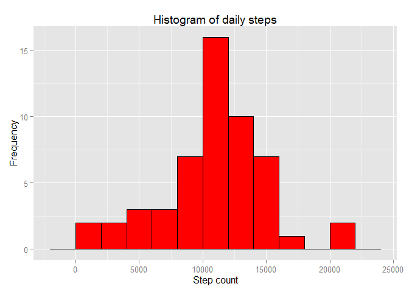
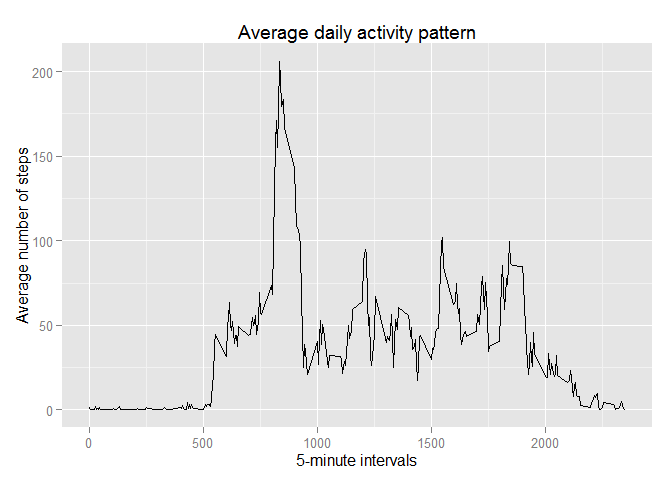
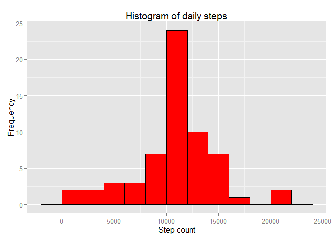
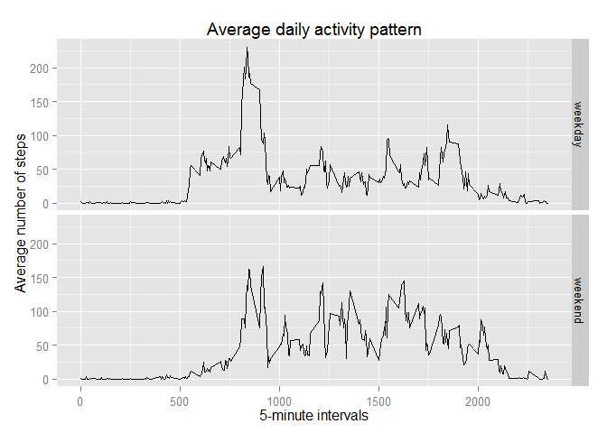

# Reproducible Research: Peer Assessment 1


## Loading and preprocessing the data
For this assigment I will be using following libaries `dplyr` for data manipulation, `lubridate` to manage dates and `ggplot2` for graphing data. It is important to make sure we are using english time system, so we can get english weekdays.

```r
library(dplyr)
```

```
## 
## Attaching package: 'dplyr'
## 
## The following object is masked from 'package:stats':
## 
##     filter
## 
## The following objects are masked from 'package:base':
## 
##     intersect, setdiff, setequal, union
```

```r
library(lubridate)
library(ggplot2)
Sys.setlocale("LC_TIME", "English")

unzip("activity.zip")

data<-tbl_df(read.csv("activity.csv",header = TRUE, sep = ",",)) %>%
  mutate(date = ymd(date))
```


## What is mean total number of steps taken per day?
Following graph shows number of steps that was recorded for each day. All `na` data was removed.

```r
histdata <- data %>%
  filter(!is.na(steps)) %>%
  group_by(date) %>%
  summarise(sum = sum(steps))


ggplot(data = histdata, mapping = aes(x = sum)) + 
  geom_histogram(color="black", 
                 fill="red", 
                 binwidth = 2000) +
  xlab("Step count") + 
  ggtitle( "Histogram of daily steps") +
  ylab("Frequency")
```

 

The average and median values of steps across all days is:

```r
mmdata <- histdata %>%
  summarise(mean = mean(sum), median = median(sum))

mmdata
```

```
## Source: local data frame [1 x 2]
## 
##       mean median
## 1 10766.19  10765
```


## What is the average daily activity pattern?
Next graph shows average daily pattern of activity. As we can see there is a huge spike of activity aroung 8-9am

```r
activitydata <- data %>%
  filter(!is.na(steps)) %>%
  group_by(interval) %>%
  summarise(mean = mean(steps))


qplot(interval, mean, data = activitydata,  
      geom = "line",
      xlab = "5-minute intervals", 
      ylab = "Average number of steps",
      main = "Average daily activity pattern")
```

 


Interval with highest number of steps:

```r
topinterval <- activitydata %>%
  top_n(1, mean)

topinterval$interval
```

```
## [1] 835
```


## Imputing missing values
We want to replace missing data with average data. We will take average across all days for each interval (shown on last graph) and use it to fill `na` using `interval` as a join key.

But firstly lets see how much data is missing:

```r
nadata <- data %>%
  filter(is.na(steps)) %>%
  summarise(n = n())

nadata
```

```
## Source: local data frame [1 x 1]
## 
##      n
## 1 2304
```


Now we fill missing data and again crate histogram of step counts in given interval and check again average and median across all days.

```r
filleddata <- data %>%
  left_join(activitydata, by = "interval") %>%
  mutate(steps = ifelse(is.na(steps),mean, steps)) %>%
  select(steps, date, interval)


filledhistdata <- filleddata %>%
  filter(!is.na(steps)) %>%
  group_by(date) %>%
  summarise(sum = sum(steps))


ggplot(data = filledhistdata, mapping = aes(x = sum)) + 
  geom_histogram(color="black", 
                 fill="red", 
                 binwidth = 2000) +
  xlab("Step count") + 
  ggtitle( "Histogram of daily steps") +
  ylab("Frequency")
```

 

```r
filledmmdata <- filledhistdata %>%
  summarise(mean = mean(sum), median = median(sum))


filledmmdata
```

```
## Source: local data frame [1 x 2]
## 
##       mean   median
## 1 10766.19 10766.19
```


Since we replaced missing data with average for each interval the mean should stay the same, but median should slightly change and move closer to average values. Below is percentage change for both values:

```r
meanchange<-(mmdata$mean - filledmmdata$mean) / mmdata$mean * 100
medianchange<-(mmdata$median - filledmmdata$median) / mmdata$median * 100

data.frame(meanchange,medianchange)
```

```
##   meanchange medianchange
## 1          0  -0.01104207
```


## Are there differences in activity patterns between weekdays and weekends?
Now lets check how our behavior varies in between weekend and a regular weekday:


```r
days <- weekdays(data$date)

paneldata <- filleddata %>%
  mutate(weekday = as.factor(ifelse(weekdays(date) %in% c("Sunday","Saturday"),"weekend", "weekday"))) %>%
  group_by(weekday, interval) %>%
  summarise(mean = mean(steps))


qplot(interval, mean, data = paneldata, 
      facets = weekday ~ ., 
      geom = "line",
      xlab = "5-minute intervals", 
      ylab = "Average number of steps",
      main = "Average daily activity pattern")
```

 


